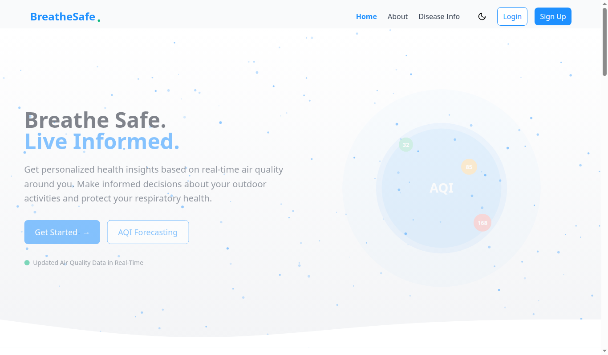
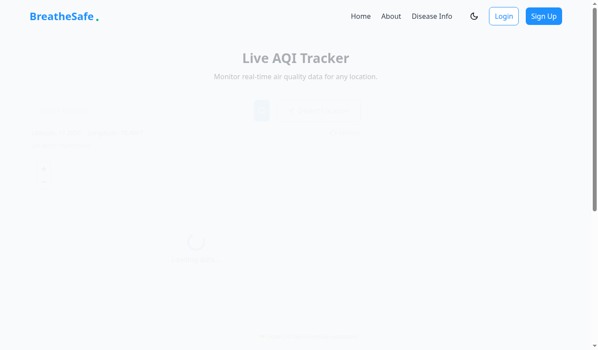
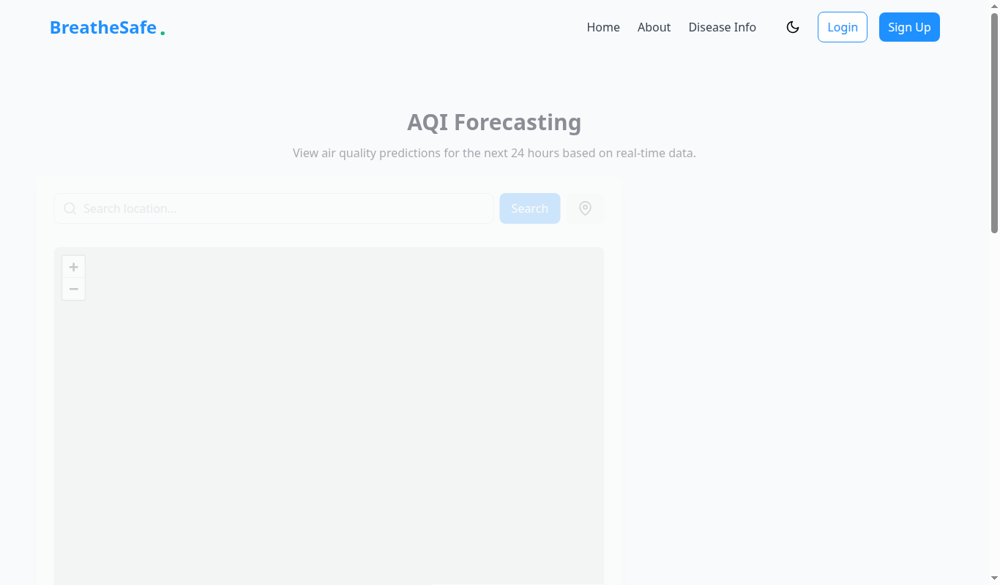
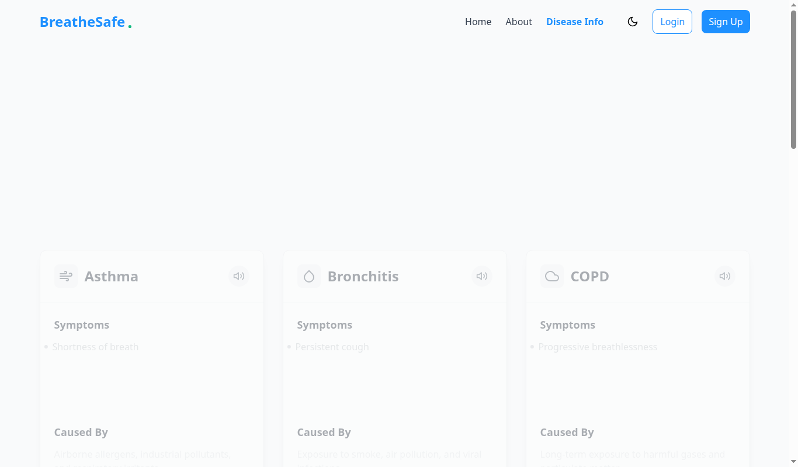
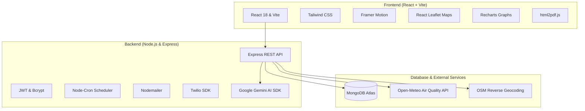

# BreatheSafe 🌿 | AI-Powered Air Quality & Health Advisory Platform

[](https://react.dev/)
[](https://nodejs.org/)
[](https://www.mongodb.com/)
[](https://ai.google.dev/)
[](https://tailwindcss.com/)
[](LICENSE)

---

## 🔑 Test Credentials

Use the following credentials to test all authenticated features (Personalized Health Reports, AQI History, Alert Subscriptions, and User Dashboard):

| Field | Primary Account | Secondary / Demo Account |
| :--- | :--- | :--- |
| **Email** | `raghu@gmail.com` | `raghugoddumuri246@gmail.com` |
| **Password** | `raghu123` | `Raghu123` |

---

## 💡 The Problem & Core Idea

Air pollution is one of the leading global health hazards, disproportionately affecting individuals with pre-existing respiratory and cardiovascular conditions such as **Asthma, COPD, Sinusitis, and Allergies**.

Traditional weather and AQI apps only display raw index numbers without actionable medical context. **BreatheSafe** bridges this gap by correlating **hyper-local real-time environmental data** with **individual health profiles** to provide:
1. **Actionable Personalized Health Guidance**: Knowing exactly what precautions, mask types, and medication protocols to follow based on your personal health symptoms.
2. **Predictive Air Quality Forecasts**: Enabling vulnerable individuals to plan outdoor routines safely.
3. **Automated Alerts**: Timely SMS and Email notifications before high-pollution spikes occur.

---

## 🖼️ Application Screenshots

### 1. Home & Platform Overview

*Modern hero interface showcasing real-time air quality search, health risk overview, and educational insights.*

---

### 2. Live AQI Tracker & Interactive Map

*Interactive map integration with OpenStreetMap & Leaflet, providing live US EPA AQI readings, temperature, and detailed pollutant breakdowns (PM2.5, PM10, CO, NO₂, SO₂, O₃).*

---

### 3. Predictive Air Quality Forecasting

*Visual trend charts, pollutant predictions, and weather forecasting to help plan outdoor activities safely in advance.*

---

### 4. Respiratory Health & Disease Awareness Hub

*Comprehensive resource library covering Asthma, COPD, Bronchitis, and preventive environmental health strategies.*

---

## ✨ Key Features

### 🌍 Real-Time Multi-Pollutant Monitoring
- **Interactive Geospatial Map**: Click anywhere in the world or auto-detect your location to fetch real-time air quality.
- **Detailed Pollutant Breakdown**: Instant metrics for $\text{PM}_{2.5}$, $\text{PM}_{10}$, $\text{CO}$, $\text{NO}_2$, $\text{SO}_2$, and $\text{O}_3$ with US EPA severity levels.
- **Micro-Climate Data**: Integrated ambient temperature, weather conditions, and atmospheric data.

### 🧠 Personalized AI Clinical Health Reports
- **Dynamic AI & Clinical Engine**: Powered by Google Gemini AI with automatic resilient clinical fallback for 100% uptime.
- **Symptom-Specific Guidance**: Tailored recommendations for cough, wheezing, shortness of breath, eye irritation, and more.
- **Chronic Condition Protection**: Specialized protocols for Asthma, COPD, Sinusitis, and Sleep Apnea.
- **Protection & Gear Advice**: Precise mask recommendations (N95/KN95 vs. surgical) and supplemental oxygen support guidelines.
- **PDF Export**: Download complete, formatted clinical health reports with a single click.
- **Audio Voice Synthesis**: Built-in speech synthesis allowing users to listen to their health advisories hands-free.

### 📈 Predictive Trend Analysis
- **Hourly & Daily Forecasting**: Interactive Recharts graphs showing predicted pollutant concentration shifts.
- **Outdoor Safety Advisor**: Clear recommendations on safe outdoor workout hours and high-risk periods.

### 🚨 Multi-Channel Alert & Notification System
- **SMS Notifications**: Automated SMS alerts powered by Twilio.
- **Email Digest**: Daily morning air quality reports and critical threshold alerts via Nodemailer.
- **Automated Cron Jobs**: Scheduled background monitoring engine running automated daily health checks.

### 🌗 Premium UI & Accessibility
- **Dark & Light Mode**: Fluid theme switching with persistent user preference.
- **Responsive Animations**: Micro-interactions and smooth page transitions built with Framer Motion.
- **AI Chatbot Assistant**: Embedded conversational assistant for instant air quality and respiratory queries.

---

## 🛠️ Technology Stack



### Frontend
- **Framework**: React 18 with Vite
- **Styling**: Vanilla CSS & TailwindCSS (Glassmorphism & Responsive Design)
- **Animations**: Framer Motion
- **Maps**: Leaflet & React-Leaflet
- **Data Visualization**: Recharts
- **Icons**: React Icons (Feather Icons)
- **Export**: html2pdf.js

### Backend
- **Runtime**: Node.js & Express.js
- **Database**: MongoDB & Mongoose ORM
- **AI Engine**: Google Generative AI (`@google/generative-ai` - Gemini 1.5/2.0 Flash)
- **Authentication**: JSON Web Tokens (JWT) & bcrypt.js
- **Messaging & Alerts**: Twilio (SMS), Nodemailer (Email)
- **Task Scheduling**: Node-Cron

---

## 🚀 Getting Started & Local Setup

### Prerequisites
- [Node.js](https://nodejs.org/) (v18.0.0 or higher)
- [MongoDB](https://www.mongodb.com/) (Local instance or MongoDB Atlas URI)
- (Optional) [Google Gemini API Key](https://aistudio.google.com/) for AI-generated reports

---

### 1. Clone the Repository
```bash
git clone https://github.com/raghugoddumuri246-ai/BreatheSafe.git
cd BreatheSafe
```

---

### 2. Backend Setup
```bash
cd backend
npm install
```

Create a `.env` file in the `backend/` folder:
```env
PORT=5001
MONGODB_URI=mongodb://localhost:27017/breathsafe
JWT_SECRET=your_jwt_secret_key_here
GEMINI_API_KEY=your_gemini_api_key_here

# (Optional) Email Alerts
EMAIL_USER=your_email@gmail.com
EMAIL_PASS=your_app_password

# (Optional) SMS Alerts
TWILIO_ACCOUNT_SID=your_twilio_sid
TWILIO_AUTH_TOKEN=your_twilio_token
TWILIO_FROM_NUMBER=+1234567890
```

Start the backend server:
```bash
npm run dev
# Server runs on http://localhost:5001
```

---

### 3. Frontend Setup
In the project root directory:
```bash
cd ..
npm install
npm run dev
# Frontend runs on http://localhost:5173
```

---

## 📡 REST API Summary

| Method | Endpoint | Description | Auth Required |
| :--- | :--- | :--- | :---: |
| `POST` | `/api/auth/signup` | Register a new user account | No |
| `POST` | `/api/auth/login` | Authenticate user and receive JWT | No |
| `GET` | `/api/auth/me` | Fetch authenticated user profile | Yes |
| `GET` | `/api/health-assessment/latest` | Retrieve user's latest clinical profile | Yes |
| `POST` | `/api/health-assessment` | Submit or update health assessment form | Yes |
| `POST` | `/api/health-report/generate` | Generate personalized AI health report | Yes |
| `GET` | `/api/health-report/my-reports` | List all historical reports for user | Yes |
| `GET` | `/api/health-report/reports/:id`| Get full details of a specific report | Yes |
| `GET` | `/api/health-report/count` | Total health reports count for user | Yes |
| `POST` | `/api/aqi-tracker/save` | Save AQI search to user history | Yes |
| `GET` | `/api/aqi-tracker/history` | Retrieve saved search history | Yes |
| `POST` | `/api/alerts/subscribe` | Configure custom email/SMS alert rules | Yes |

---

## 📄 License

This project is licensed under the [MIT License](LICENSE).

---

## 🤝 Contributing & Feedback

Contributions, suggestions, and feature requests are welcome! Feel free to open an issue or submit a pull request.
